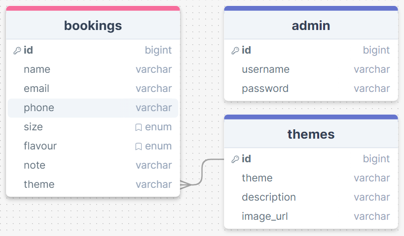
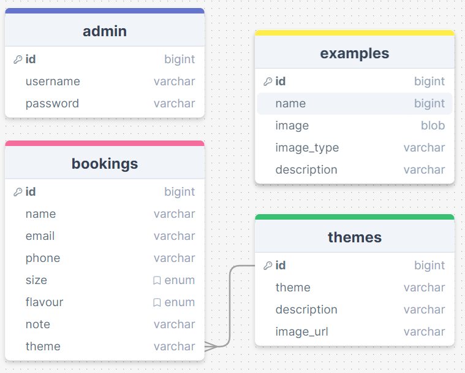
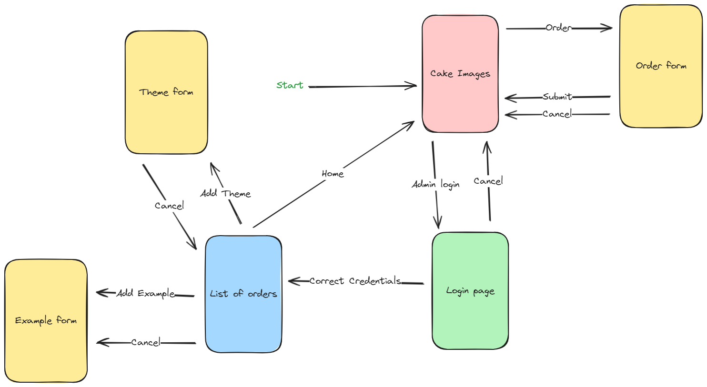
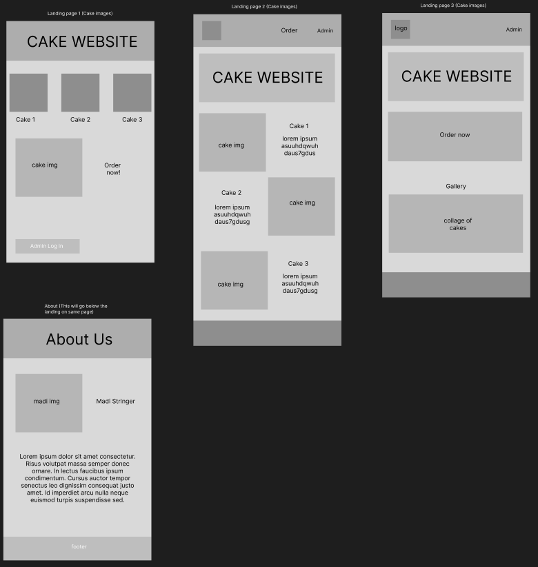
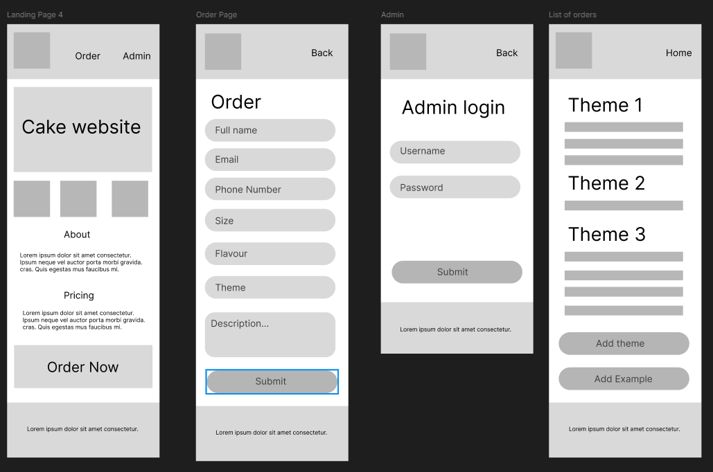
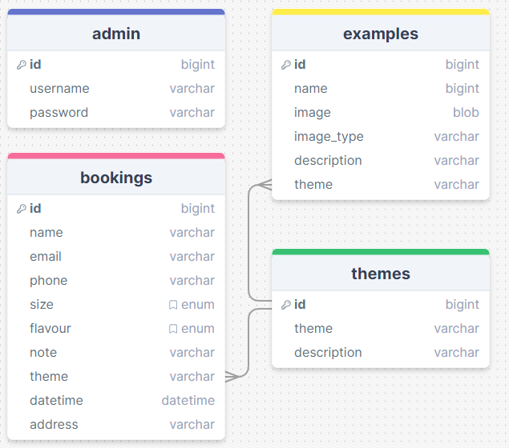
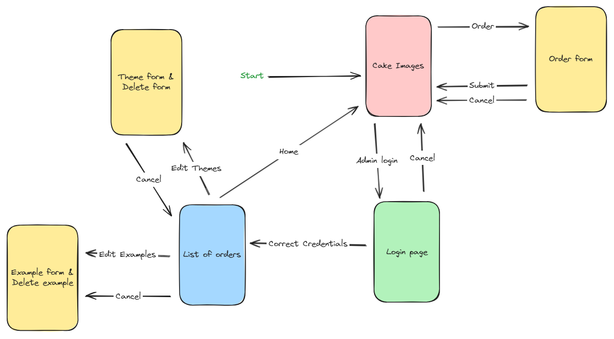
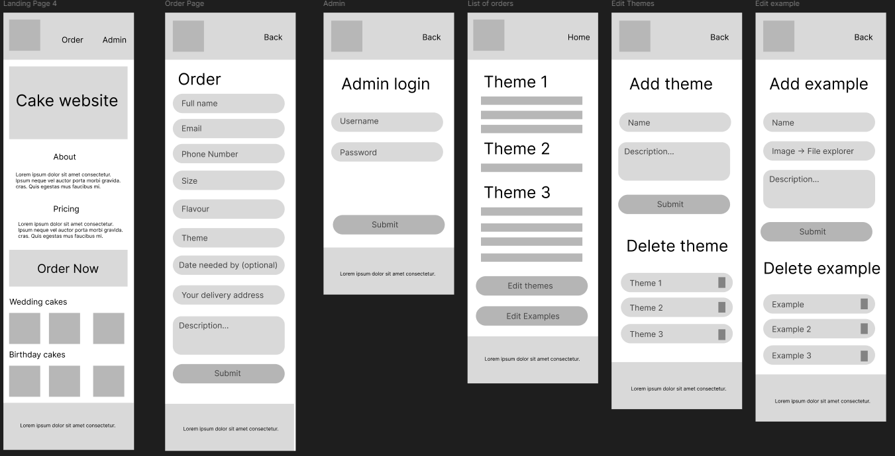
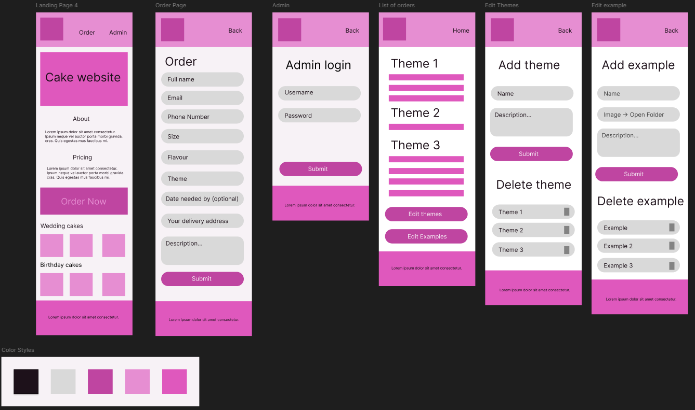
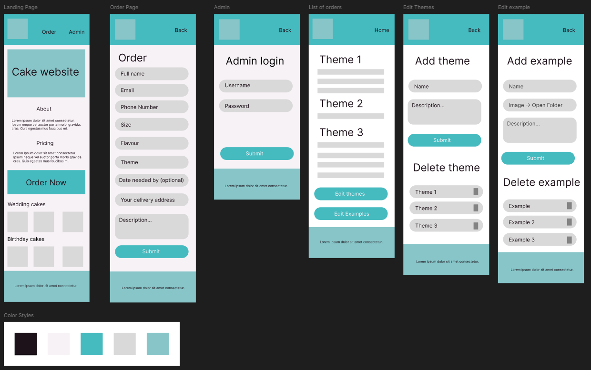

# Development of a Database-Linked Website for NCEA Level 2

Project Name: **Mad as Cakes**

Project Author: **Harry Stringer**

Assessment Standards: **91892** and **91893**

-------------------------------------------------

## Design, Development and Testing Log

### 16/05/24

Database structure

Today I made the structure for the database for the website. There will be a database with admin login credentials, a list of themes for the cake that will help them be organized on the site, and the booking details.

### 20/05/2024

Improved database and made a flow chart

Today I added another database that will store exemplar images and descriptions about previous cakes my sister has baked.

Next I made a flowchart to draft how the end users will navigate through the site.

I showed this flowchart to my client (my sister)

>That looks like it will work fine.

### 21/05/2024

Today I made some drafts in Figma. These designs are pretty loose and are not perfectly to scale with any phone screen, so this will need to be changed.

### 23/05/2024

Today I continued to work on the loose diagrams.example pages with figma. This time the screen proportions and resolution are consistent with that of an iPhone 13/14. I will show these to my client on Saturday to see whether or not they are going to work for her, and what I should tweak.

### 25/05/2024

Today I discussed my ideas with my client.

She didn't like the idea of having any pictures of herself in the about page.
> - "[The picture of her] It's shit!"
> - "If someone requests something to extravagant and I don't have the skillset or the timeframe then there must be a way to reject it."
> - "I need to see if there is a time limit."
> - "Needs to specify their address or would need to pay for delivery or come pick it up."
> - "It needs to specify that it's in the Nelson area."

I need to add more in depth size options (i.e. add dimensions of the cake tins) and add a shape option.
There also must be a way to delete themes as well as add them.

The option for the landing page that she preferred the most is Landing Page 4.

### 25/05/2024

Today I implemented the feedback that I got from my client.

- On the about section it will have the location of the business
- About section will not have a picture of her 
- There will be a new column on the bookings db for date and time (The date that the order is due by)
- Added a new column for address
- Options to delete an example or theme
- On the pricing section there will be a delivery fee stated (delivery only available in Nelson region)

Flowchart MK 2. Now with time, date & pickup on bookings.

DB Plan MK 3. Now with delete options for example & theme.

### 30/05/2024

Today I was working on the wireframe in Figma

I edited the landing page to include the example images at the bottom in categorized groups rather than have them be directly under the header. I think that this makes the site more concise and easily navigable. I will need to discuss this change with my client as they stated that they liked the landing page. I also added the edit themes page and edit examples page.

Later, I added colour to the wireframe. The colour palette that I used was automatically generated from Realtime Colors. I am not sure what my client wants colour scheme wise, so this will more than likely completely change in the future.

Below is the link to the realtime colour website i used to generate the colours.
- https://www.realtimecolors.com/?colors=1d111a-f7f2f6-bf45a1-e68ed2-df58bd&fonts=Inter-Inter

### 10/06/2024

Today I received & implemented feedback from my client

Over the weekend I showed my client the small changes that I made to the wireframe and the colours that I implemented. I showed her using the figma app on my phone. She gave me some constructive feedback about my design.

She liked the change I made to the landing page, but not the colours.
>"The first page actually looks better now with the pictures at the bottom. I don't really like the colours that you have chosen though. I'd rather the main theme be a cyan/blue colour rather than pink, and the website needs to be more neutral. I think that the pink everywhere makes it looks too childish rather than an actual business. There is too much colour everywhere."

After hearing her criticisms, I made these changes to the design.

I Changed the colours to be more neutral & blue as she requested

Below is the link to the realtime colour website i used to generate the colours.
- https://www.realtimecolors.com/?colors=1d111a-f7f2f6-45babf-D9D9D9-87c5c8&fonts=Inter-Inter

### DATE HERE

Replace this test with what you are working on

Replace this text with brief notes describing what you worked on, any decisions you made, any changes to designs, etc. Add screenshots / links to other media to illustrate your notes where necessary.

### DATE HERE

Replace this test with what you are working on

Replace this text with brief notes describing what you worked on, any decisions you made, any changes to designs, etc. Add screenshots / links to other media to illustrate your notes where necessary.

### DATE HERE

Replace this test with what you are working on

Replace this text with brief notes describing what you worked on, any decisions you made, any changes to designs, etc. Add screenshots / links to other media to illustrate your notes where necessary.

### DATE HERE

Replace this test with what you are working on

Replace this text with brief notes describing what you worked on, any decisions you made, any changes to designs, etc. Add screenshots / links to other media to illustrate your notes where necessary.

### DATE HERE

Replace this test with what you are working on

Replace this text with brief notes describing what you worked on, any decisions you made, any changes to designs, etc. Add screenshots / links to other media to illustrate your notes where necessary.