# The Design of a Database-Linked Website for NCEA Level 2

Project Name: **Cake shop website**

Project Author: **Harry Stringer**

Assessment Standards: **91892** and **91893**

-------------------------------------------------

## System Requirements

### Identified Need or Problem

My sister Madison owns a cake business where clients request a certain type of cake and she will make it for them. Her business has grown to the point where keeping track of all of her orders is difficult and the process of ordering cakes needs to be streamlined.

### End-User Requirements

Clients who want a cake to be made for them come from all walks of life. There is no specific age that they would be. Therefore the website must be clear, concise and easy to use.

The level of IT knowledge that users may have will vary greatly. This means that the website must be easy to navigate & use.

My sister will also be an end user as she will use the site to view the orders that have been placed.

### Proposed Solution

To help my sister deal with the growing size & capabilities of her cake business, I will produce a website that allows customers to place a custom order for a cake, and allows my sister to view a list of the orders that have been placed.

On my website the customers should be able to:
- place an order for a cake
- view past examples of cakes (ordered by theme)

On my website my sister should be able to:
- view a list of orders that have been placed
- edit the example images that are displayed

Additionally the website should be
- easy to use
- enjoyable to use
- aesthetically pleasing

-------------------------------------------------

## Relevant Implications

### USABILITY

The usability implication entails how easy it is to use a website.

This implication is relevant to my project because there will be a wide range of different people using my website who will have varying IT skills.

When designing the user interface for my website I will use Nielson's usability heuristics to ensure that my website is easy and intuitive to use. I will need to keep in mind visibility of system status, one of Nielsons' heuristics. This means alerting the user when something is wrong, such as adding an error screen. Another heuristic I will need to consider is consistency and standards. The UI should be clear and consistent through out the whole site with different colours to make it easy to see. A third heuristic to keep in mind is recognition rather than recall. This essentially means using well known icons & symbols to make using the website easy for the end user. To verify all of this I will test my website with a range of users and observe how easy it is for them to use.

### FUNCTIONALITY

The functionality implication entails whether the website works as intended or not.

This implication is relevant to my project because having a working website is critcial to the user experience. The website must not have any errors and must be easily navigable for users of all expertise. 

Going forward with this project I will need to ensure that the website is fully functional and does not have any critical errors. It must meet the user requirements. To verify this I will test my website with a range of users and observe how easy it is for them to use.

### AESTHETICS

The aesthetics implication is how the website looks.

Aesthetics is absolutely vital to the user experience. Having a website that looks good will leave a good impression on the user.

I will need to make sure that the aesthetics and feel of the site remain consistent through out the whole site. I will use aspects of colour theory to make sure that my website looks good and follows common colouring conventions.

### END USERS

The end user implication is the specific needs that the users have from the website.

This implication is relevant to my project because the website must appeal to the user's needs in order to be successful. I will have to ensure that I am appealing to the right demographic (that is being people who want cakes made for them).

I will need to make sure that the website fulfills all of the requirements that the user may have. It is important to know your userbase in order to do this. I will test this by gathering feedback from users and asking them if it fulfilled all of their needs.

### SOCIAL 

The social implication is how the website affects the user personally.

This implication is relevant to my project because the website must have a positive social impact on the users. This can be by using friendly language and being inclusive to all users.

I will need to make sure that the website fulfills all of the social needs for a user by using clear language that should not be able to be interpreted as controversial.

-------------------------------------------------

## Final System Design

### Database Structure

This was my final design for the structure of my database, made in DrawSQL.

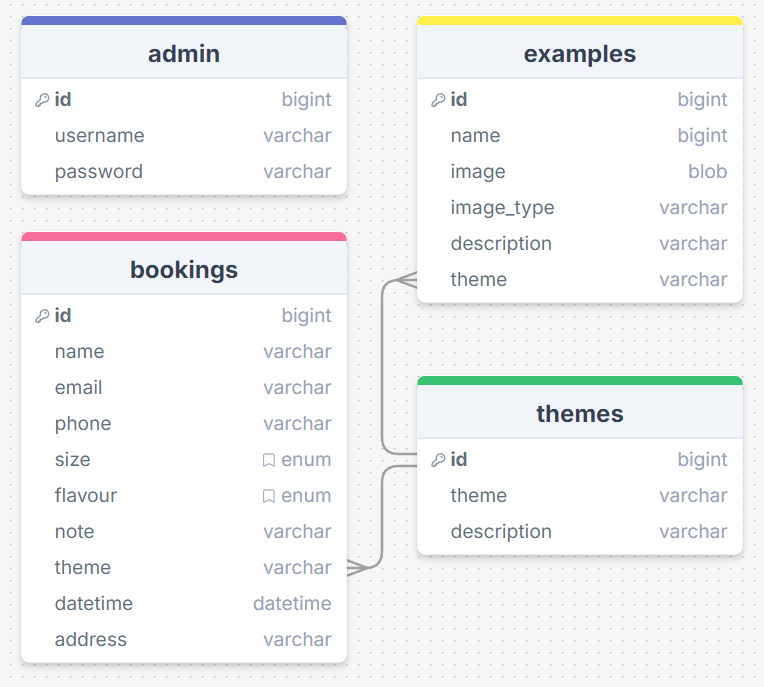

### User Interface Design

This was the final wireframe of my website, made in Figma.

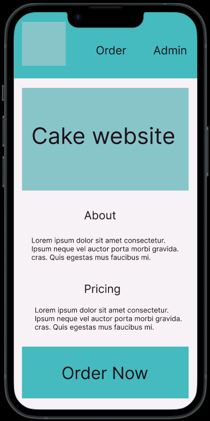
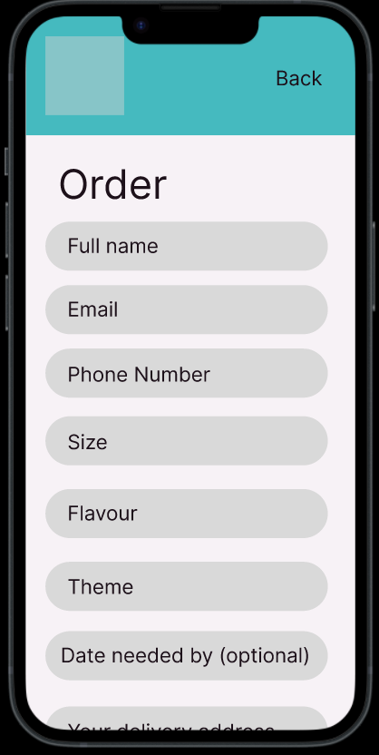

-------------------------------------------------

## Completed System

### Database Structure

The final database structure that I used. Little has been altered, some new columns such as 'image_data' & 'delivery'.

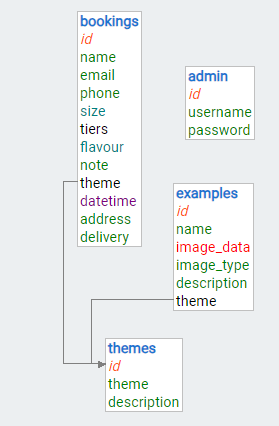

### User Interface Design

Index/home page

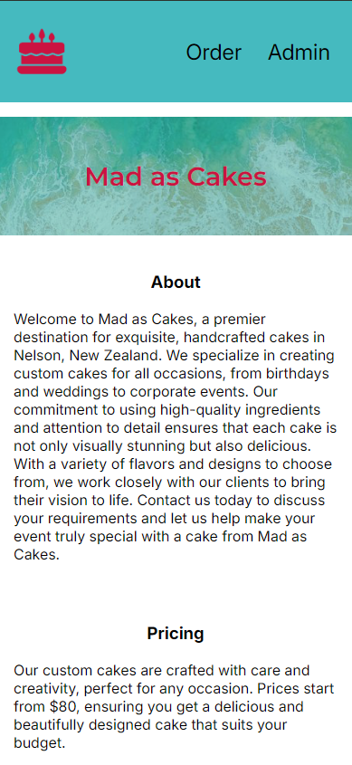

Order screen for when a customer is placing an order.

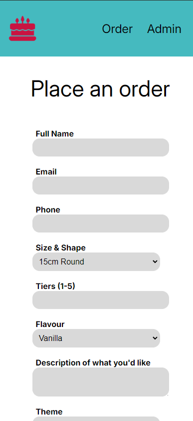

List of orders as seen on the admin page

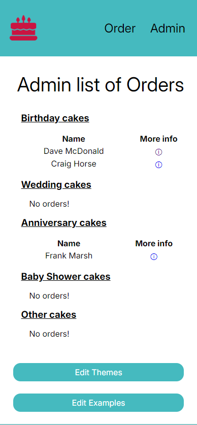

Index page on desktop

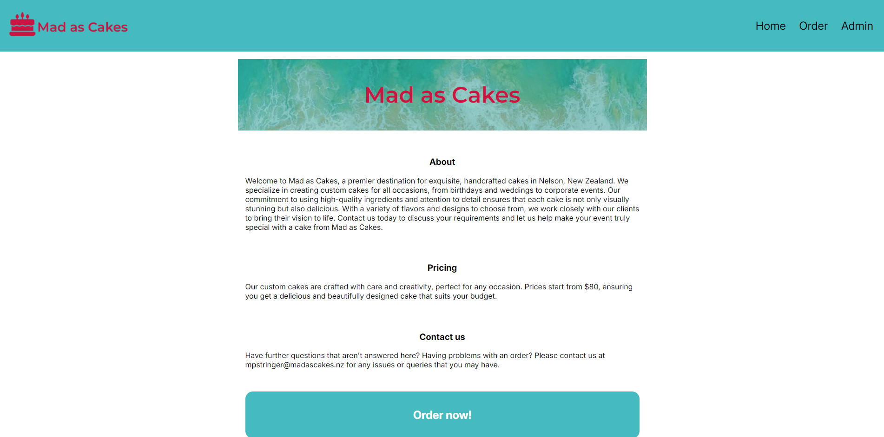

-------------------------------------------------

## Review and Evaluation

### Meeting the Needs of the Users

Replace this text with a brief evaluation of how well you met the needs of your users. Look at what you initially wrote about who they are, what specific needs they have, etc. and discuss how well the system meets those needs.

I wrote that my end users would be pretty much anybody, and this was correct. Consulting my client, I found that anyone and everyone can order a cake, and they do so for a wide variety of reasons.
I stated that my end users may have little to no tech knowledge, so my website must be easy to use. I accomplished this goal, as my website follows common design principles like Nielson's heuristics. In order to ensure that my website was easy to use, I tested my site with several different people. Of course I gave it to my client (my sister, who is fourteen) and she had no difficulties whatsoever. I also tested it with both of my parents and my grandparents, and none of them had difficulty navigating or using the site either.

### Meeting the System Requirements

Replace this text with a brief evaluation of how well you met the requirements that you defined at the start of the project, etc. Look back at the list of features / functionality you initially set and discuss how well your system has implemented each one.

I wrote at the start that users should be able to order a cake, and view past examples of cakes. Both of these features were implemented and are working as intended. My sister was supposed to be able to view orders that have been placed, and edit the example images on the index page. Again, both of these features are implemented and working. All evidence of this can be found in the Completed System section above. Additionally, I stated that the site should be aesthetically pleasing as well as easy and enjoyable to use. I followed colour theory to ensure that my website was aesthetically pleasing. After my parents and grandparents used the site, I asked them if they thought that the site was easy and enjoyable to use, and all of them said that it was. 

### Review of USABILITY

Usability was an element that I made sure to account for throughout the development of my project. I made sure to follow Nielson's usability heuristics to ensure that my website is universally usable. One of the heuristics that I used was 'consistency and standards'. I made sure that the design of my website was consistent throughout all of the pages on my site. All of the pages include the same navbar and footer at the bottom, and every input field is consistent with each other. Another heuristic that I addressed was 'recognition rather than recall'. This means that iconography should be used that is universally understandable. I used this heuristic when adding delete buttons, as all delete buttons have an icon of a rubbish bin. The bin icon is very simple line art, so that it cannot be confused with anything else. A third heuristic that I accounted for was 'visibility of system status'. I used this heuristic throughout the site. This can be seen on the page when a customer has placed the order, it alerts them about whether or not the order went through. As I stated at the start of the project, I said that I would test the site with a variety of different users. I did test the site with my parents, grandparents and  friends. None of them struggled to use the site, so I think it is evident that the site is easy to use.

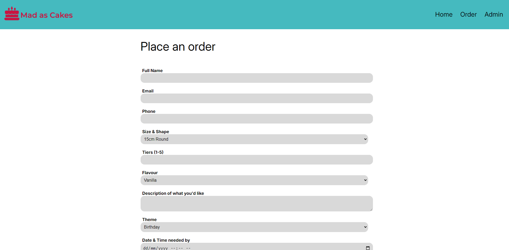

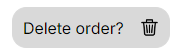

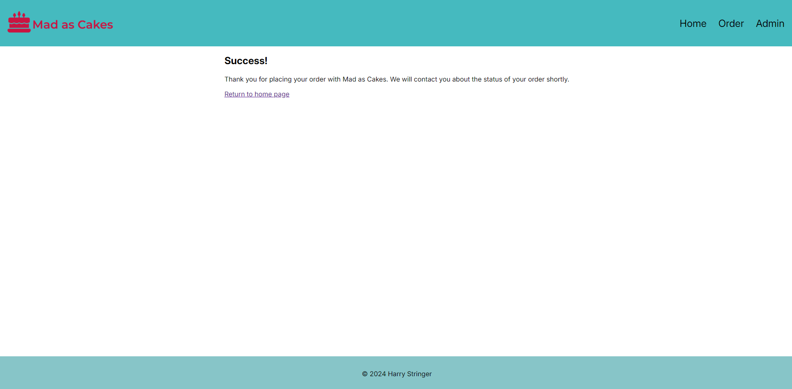

### Review of FUNCTIONALITY

The functionality implication means that my website works as intended. After developing my website I can say that this is the case. I tested my website with a large demographic of people, including my grandparents, parents, friends and siblings. All of them were able to use and understand the website with ease. None of them encountered any errors when they were using the site. I worked hard to make sure that there were a myriad of error prevention protocols in place. For instance, if the user puts in an email that is not valid on the order form, they will get a popup displaying this. 

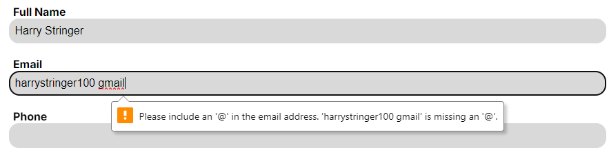

### Review of AESTHETICS

The aesthetics implication was one that I followed closely throughout my project. I made sure to adhere to colour theory by picking colours that matched nicely with each other. My client wanted blue as the main colour to be used, so most of the elements and buttons are blue. For the logo, I used a pinkish red colour. This contrasts nicely with the blue colour that I have. This is because blue and red are primary colours, so they complement each other well. I used trigonal colour theory to determine this, but I didn't want to use a third colour (would have been yellow) because I felt that it made the site too inconsistent. 

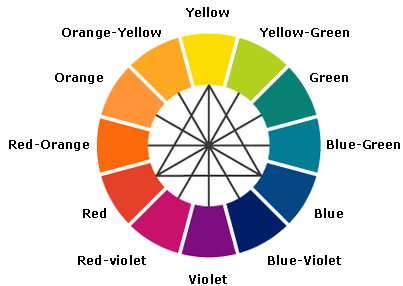

### Review of END USERS

The user demographic for my site is extremely wide/broad, that being people who want cakes baked for them (which is a lot of people!) Because of this I needed the design of my website to appeal to a wide variety of people, so it could not be too niche. I accomplished this, as the design of my site is very simple and easy to read. It allows the end users to do what they want, which is order a cake, with ease. This means that my site fills the end users' requirements. To ensure that it did, I trialed the site with a variety of different peoples and asked if they thought that it fulfilled there needs. All of them said that it did, so I have definitely accomplished this.

### Review of SOCIAL

The social implication was one that I addressed well. No language that could be interpreted as offensive was used, and all language is inclusive and non-discriminatory. Furthermore, the language used is clear and not ambiguous. These asepects help users of all walks of the earth feel comfortable and included whilst using the site.

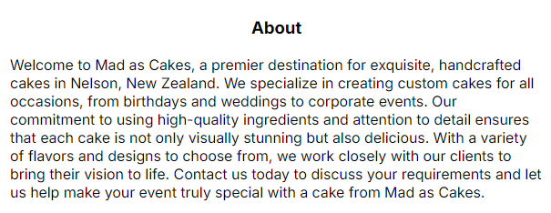

