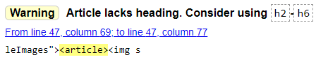
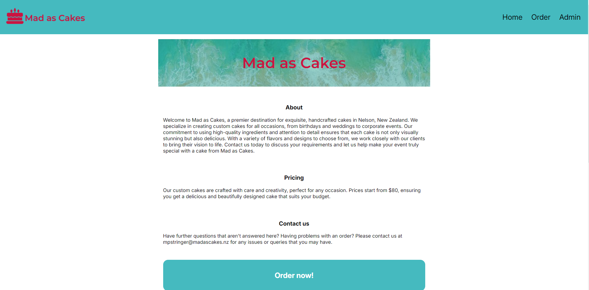

# Development of a Database-Linked Website for NCEA Level 2

Project Name: **Cake shop website**

Project Author: **Harry Stringer**

Assessment Standards: **91892** and **91893**

-------------------------------------------------

## Design, Development and Testing Log

### 16/05/24

Database structure

Today I made the structure for the database for the website. There will be a database with admin login credentials, a list of themes for the cake that will help them be organized on the site, and the booking details.

### 20/05/2024

Improved database and made a flow chart

Today I added another database that will store exemplar images and descriptions about previous cakes my sister has baked.

Next I made a flowchart to draft how the end users will navigate through the site.

I showed this flowchart to my client (my sister)

>That looks like it will work fine.

### 21/05/2024

Today I made some drafts in Figma. These designs are pretty loose and are not perfectly to scale with any phone screen, so this will need to be changed.

### 23/05/2024

Today I continued to work on the loose diagram example pages with figma. This time the screen proportions and resolution are consistent with that of an iPhone 13/14. I will show these to my client on Saturday to see whether or not they are going to work for her, and what I should tweak.

### 25/05/2024

Today I discussed my ideas with my client.

She didn't like the idea of having any pictures of herself in the about page.
> - "[The picture of her] It's shit!"
> - "If someone requests something too extravagant and I don't have the skillset or the timeframe then there must be a way to reject it."
> - "I need to see if there is a time limit."
> - "Needs to specify their address or would need to pay for delivery or come pick it up."
> - "It needs to specify that it's in the Nelson area."

I need to add more in depth size options (i.e. add dimensions of the cake tins) and add a shape option.
There also must be a way to delete themes as well as add them.

The option for the landing page that she preferred the most is Landing Page 4.

### 25/05/2024

Today I implemented the feedback that I got from my client.

- On the about section it will have the location of the business
- About section will not have a picture of her 
- There will be a new column on the bookings db for date and time (The date that the order is due by)
- Added a new column for address
- Options to delete an example or theme
- On the pricing section there will be a delivery fee stated (delivery only available in Nelson region)

DB Plan MK 3. Now with time, date & address on bookings.

Flowchart MK 2.  Now with delete options for example & theme.

### 30/05/2024

Today I was working on the wireframe in Figma

I edited the landing page to include the example images at the bottom in categorized groups rather than have them be directly under the header. I think that this makes the site more concise and easily navigable. I will need to discuss this change with my client as they stated that they liked the landing page. I also added the edit themes page and edit examples page.

Later, I added colour to the wireframe. The colour palette that I used was automatically generated from Realtime Colors. I am not sure what my client wants colour scheme wise, so this will more than likely completely change in the future.

Here is the real time color page that I used to determine the new colours

The link I used to generate the colours can be found [here.](https://www.realtimecolors.com/?colors=1d111a-f7f2f6-bf45a1-e68ed2-df58bd&fonts=Inter-Inter)

### 10/06/2024

Today I received & implemented feedback from my client

Over the weekend I showed my client the small changes that I made to the wireframe and the colours that I implemented. I showed her using the figma app on my phone. She gave me some constructive feedback about my design.

She liked the change I made to the landing page, but not the colours.
>"The first page actually looks better now with the pictures at the bottom. I don't really like the colours that you have chosen though. I'd rather the main theme be a cyan/blue colour rather than pink, and the website needs to be more neutral. I think that the pink everywhere makes it looks too childish rather than an actual business. There is too much colour everywhere."

After hearing her criticisms, I made these changes to the design.

I Changed the colours to be more neutral & blue as she requested

Below is the link to the realtime colour website i used to generate the colours.
The link I used to generate the colours can be found [here.](https://www.realtimecolors.com/?colors=1d111a-f7f2f6-45babf-D9D9D9-87c5c8&fonts=Inter-Inter)

### 13/06/2024

Got feedback from client

Yesterday I had a chat with my client to see whether or not she liked the new colours that I had implemented.

>"That looks way better. I think that sould work for what I want."

I asked her what kind of font she would like to use. She said that the font used in the mockups was good, so I'll just use it as it is available on google fonts. It is called inter. Find it on google fonts [here.](https://fonts.google.com/specimen/Inter)

She has given me the go ahead to start developing the actual website as she is happy with the design.

### 27/06/2024

I have been developing the site.

After developing the site I have found a problem with my UI design that will need to be changed.

Clearly this table looks very messy and will not fit nicely on a mobile device. Instead of displaying all of the order information in one giant table I have decided to have each order be on their own page. The table will display the name and the time, and then have a link to the page that has all of the more detailed order information.

Here is the final result after I made the changes stated above:

### 01/07/2024

Added a delete order function

Today I added a feature that allows orders to be deleted by the admin. This was really always needed but I just forgot about it when designing the site. I will need to inform my client of this change but I am sure that it will be okay. The delete order button is on the page with the more detailed info about the order.

### 28/07/2024

Today I had a meeting with my client to discuss how the development is going

Almost all of the actual functionality is finished, there were just some things that I needed to go over with my client. 

I showed her the delete order function 
>"Yeah, I didn't think about that but you definitely need it. Looks good."

I Showed her the change to the details presented on the Admin list of orders
>"That definitely is an improvement. It would have looked so cluttered on my phone screen."

I queried her about how the examples portion of the home page is looking, because I think that it looks a bit bad.

>"It looked good on the simple mockup but with the real images I think it looks bad. I don't like how it has the big border and title around the images. It would be better to just have the pictures without any of the description or title cluttering it."

Before the implementing the change:

After (Not super different but cleaner):

### 06/08/2024

Today I did some error testing

You used to be able to put in themes that had no information or description. I solved this by making them required when the form is filled out.

### 08/08/2024

Itinerary to be discussed with client:

- Aesthetics
- Header image for the index page
- Sizes for the cake tin
- Pricing options
- Wether or not she likes the about page text
- Name of the website
- What admin username and password she wants
- What logo she wants
- Whether or not she thinks a section for tiers is necessary on the order form

### 12/08/2024

Today I discussed the changes with my client. Here is what I found:

- Aesthetically the website was good
- We measured all of our cake tins (we have square ones that I need to add as well)
- Pricing sections should say that prices start from $80.
- About page was fine
- The name of the website is Mad as Cakes
- We changed the username to mpstringer and the password is Reading1871
- She wanted a Logo that would contrast with the blue style of the site.
- She thinks that we will need a section for tiers.

Additional problems that she had:
Certain letters need to be capitalised
Carrot was added as an option for the flavour on the bookings table
Added shape of cake tin (under size enum)
Contact info must be added to home page

Themes for cakes added:
- Baby shower
- Anniversary

I will need to implement these features tomorrow.

### 13/08/2024

Today I implemented the changes stated above and showed them to my client

I made this logo in photoshop:

>"That looks like great. I like that the colour stands out from the rest of the site."

I also added the themes 'Baby shower' & 'Anniversary' as she requested.

I added tiers as an element of the order form. Cakes can now have 1-5 tiers. Additionally, I changed the size element to be called size & shape. Before, it just had Small, Medium & Large. Now it has many different values eg. '25.5cm Square' or '23cm Round'.

### 14/08/2024

Today I trialed my site with my end users

I trialed my site today with two of my grandparents, my parents and my two sisters. I did this to test the usability and accessibility of my site. After onberving them use the site I asked if they had any difficulties or misunderstandings within the site, and unanimously no one had any issues. The fact that these people are my family may sway their opinion on my site (they may be yes-men) but I don't believe this to be the case. I watched them using the site and there didn't appear to be any misunderstandings.

>"It's working great, even a little old lady like me can do it!"

### 15/08/2024

Today I worked on my code validation.

I ran all of my documents through the site https://validator.w3.org/

## Code Validation

#### My CSS file had no errors to be resolved:

#### The index page had many errors, but most of them were along these lines:

!["Error: An [img] element must have an [alt] attribute"](images/val-index1.png)

After adding alternate text for all of the images I had no errors. I did have warnings telling me that articles don't have headers, but i will ignore this warning as the articles only contain images.

#### Order form errors:
!["Error: First child of [select] element with a [required] attribute"](images/val-order1.png)

This error is because i have a 'required' tag on a drop down menu. This is unnecessary because a value is always put in. After fixing this i ha dno errors.

#### Admin Login
Admin log in page had many errors, but these were all because I had the footer include not exavtly at the bottom of the page.

After moving the footer code I had no errors.

#### Admin overview page (index-admin)

This page had only one warning and no errors. It says that there is no header for the section, but I just have the heading above the section so I won't fix this.

The order page had only a warning saying that i do not need to define the type when i am writing in java script. I ihave removed this and now have no warnings.

#### Edit themes page (form-theme)

I got this error because I specified that a textarea was type="text" which is not needed.

!["Error: Attribute [type] not allowed on attribute [textarea] at this point."](images/val-theme1.png)

I got this error because I reused an element with an ID. I changed this to class and it resolved the error.

!["Error: Duplicate ID [deleteIcon]"](images/val-theme2.png)

The last error that I had was because I was using a 'li' tag outside of a 'ul'. I put in ul tags and it resolved all errors.

After resolving these errors I had no more warnings.

#### Edit examples page (form-example)

This page has a list of many images. All of them don't have an alt tag.

!["Error: An [img] element must have an [alt] attribute" x4](images/val-example1.png)

With this I have validated all of my pages that are visible by the browser.

## Evidence that the site works as intended

An Example of the end user using the site can be seen [here.](https://mywaimeaschool-my.sharepoint.com/:v:/g/personal/hwstringer_waimea_school_nz/EYmXF34lshZJvdcUEayX0HgBnrclJ1VRIc11P06Y5QcKXA)

the video showcases:
- How to log in
- Error detction if wrong username or password
- How to place an order
- Error detection if order form is filled out wrong
- How to view past examples of my client's work
- How the admin can view orders
- How the admin can edit the examples shown on the index page

All of this shows how the website is fully functional and works as intended.

Here are some screenshots of the final site:

Index/landing/home page

Admin page after the admin has logged in.

Clicking on the 🛈 information icon leads to a more detailed page with all of the order info.

Same info in the database

## The databse structures

Admin table and its contents

Examples table and its contents (More can be added using the site)

Themes table and its contents (More can be added using the site)

Database schema

## More screen shots of the site

The themes from the database as seen in the site

The examples from the database as seen in the site. Hovering the cursor over the image provides more information and allows the image to be deleted.

Admin Log in screen

Same screen as seen from the dimensions of an IPhone 12 Pro. Notice the navbar has a smaller logo and no 'Home' option (clicking the logo leads back to the home page).

